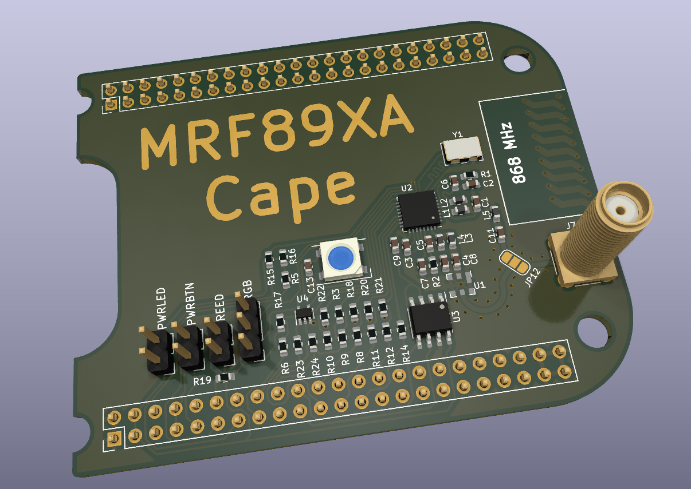

# Beaglebone Black Cape for MRF89XA RF Chip

This is a cape for the MRF89XA RF chip using the 868 MHz ISM band.
It has an onboard antenna, which is good enough for short range
communication. Otherwise and SMA connector can be used to connect
an external amplifier/antenna.

The MRF89XA is connected to the Beaglebone SPI interface and the
relevant control lines are connected to GPIOs. Additionally the
cape has support to drive a SK6812 or WS2812 LED via SPI.

## Image



## Kernel

A matching devicetree overlay can be found in the dt-overlay
directory. Neither the MRF89XA nor the RGB LED currently have
an in-kernel driver. It is possible to access them via userspace
via the spidev module like this:

```
# load spidev kernel module
modprobe spidev
# tell kernel to use spidev driver for both mrf89xa interfaces
echo spidev > /sys/bus/spi/devices/spi0.0/driver_override
echo spi0.0 > /sys/bus/spi/drivers/spidev/bind
echo spidev > /sys/bus/spi/devices/spi0.1/driver_override
echo spi0.1 > /sys/bus/spi/drivers/spidev/bind
echo spidev > /sys/bus/spi/devices/spi0.2/driver_override
echo spi0.2 > /sys/bus/spi/drivers/spidev/bind

```
Afterwards the SPI devices are available as `/dev/spidev0.0`
(mrf89xa data), `/dev/spidev0.1` (mrf89xa cfg) and `/dev/spidev0.2`
(RGB led).

## License

https://creativecommons.org/licenses/by-sa/4.0/

CC-BY-SA 2022 Sebastian Reichel <sre@mainframe.io>
